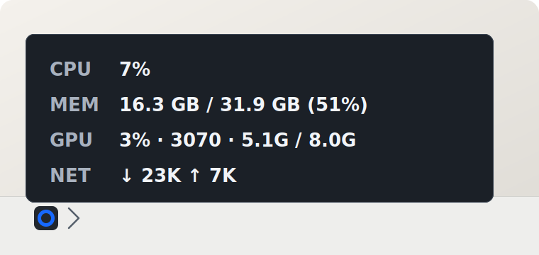
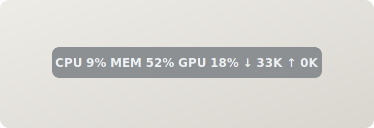

# PulseRing

<p align="center">
  
</p>

PulseRing is a quiet Tauri 2 desktop utility for Windows 10/11 and macOS. It lives in the system tray or menu bar and gives you a quick read on CPU, memory, GPU and network activity without opening a full monitoring dashboard.

中文名：脉环  
中文文档: [README.zh-CN.md](./README.zh-CN.md)

## Download

Windows builds are published on the [GitHub Releases page](https://github.com/CG1995/super-lite-status-bar/releases/latest).

- Recommended: `PulseRing_1.0.0_x64-setup.exe`
- Alternative installer: `PulseRing_1.0.0_x64_en-US.msi`
- Portable executable: `PulseRing_1.0.0_x64-portable.exe`

macOS builds are published on the same Releases page.

- Recommended: `PulseRing_1.0.0_aarch64.dmg`
- The DMG is produced by Tauri on macOS, so it is a real disk image rather than a renamed archive.

The current Windows artifacts are unsigned, so Windows may show a SmartScreen warning on first launch.
The current macOS artifacts are unsigned, so macOS may still prompt the first time you open the app.

## Preview

<p align="center">
  
</p>

<p align="center">
  
</p>

## What It Monitors

- CPU total usage
- Memory usage, used / total / percentage
- Network download and upload speed
- GPU usage, VRAM usage, temperature and model when available

GPU metrics are capability-based. The app degrades gracefully when GPU data is unavailable.

## Current UX

### Windows

- Tray icon only, no long unreadable text in the Windows tray.
- Hovering the tray icon shows a compact four-row status popup: CPU, memory, GPU, network.
- Right-click opens the tray menu: settings, autostart, floating window, logs, quit.
- Optional floating window can be enabled from settings.
- The floating window has a hover-only pin control. Other floating-window options live in the main settings panel.

### macOS

- Tauri menu bar support is scaffolded.
- Short menu bar text still needs macOS device testing.

## Tech Stack

- Tauri 2
- Rust backend
- Minimal no-framework frontend: HTML, CSS, JavaScript
- `sysinfo` for CPU, memory and network counters
- `nvidia-smi` capability path for NVIDIA GPU metrics on Windows
- Tauri autostart plugin
- Tauri single-instance plugin

## Project Structure

```text
src-tauri/
  src/
    core/
    ui/
  tauri.conf.json
ui/
  components/
  floating_bar/
  settings/
  tray/
docs/
scripts/
tests/
```

## Build

Windows prerequisites:

- Rust stable toolchain
- Microsoft Visual Studio 2022 Build Tools with MSVC C++ tools
- WebView2 Runtime

Run:

```powershell
cd C:\path\to\super-lite-status-bar\src-tauri
cargo run
```

Test:

```powershell
cd C:\path\to\super-lite-status-bar\src-tauri
cargo test
```

Package:

```powershell
cd C:\path\to\super-lite-status-bar\src-tauri
cargo tauri build --bundles nsis msi --no-sign --ci
```

Windows packaging produces:

```text
src-tauri/target/release/bundle/nsis/PulseRing_1.0.0_x64-setup.exe
src-tauri/target/release/bundle/msi/PulseRing_1.0.0_x64_en-US.msi
src-tauri/target/release/PulseRing_1.0.0_x64-portable.exe
```

macOS packaging produces:

```bash
cd /path/to/super-lite-status-bar/src-tauri
cargo tauri build --bundles dmg --no-sign --ci
```

```text
src-tauri/target/release/bundle/dmg/PulseRing_1.0.0_aarch64.dmg
```

## Security And Privacy

- Do not commit personal tokens, GitHub PATs, logs or local config files.
- User configuration is stored under the OS user config directory.
- Logs are written to the OS-specific app log directory.
- GPU collection must remain best-effort and non-fatal.

## Current Status

See [docs/DEVELOPMENT_PROGRESS.md](./docs/DEVELOPMENT_PROGRESS.md) and [CHANGELOG.md](./CHANGELOG.md).

## License

License has not been finalized by the project owner.
