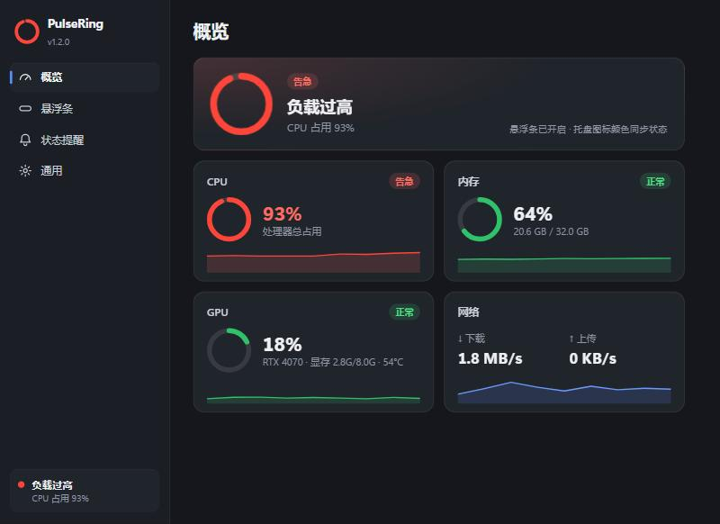
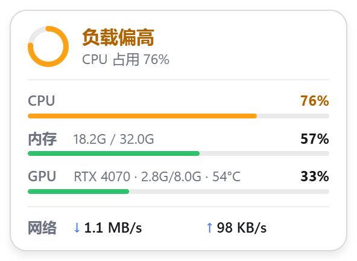
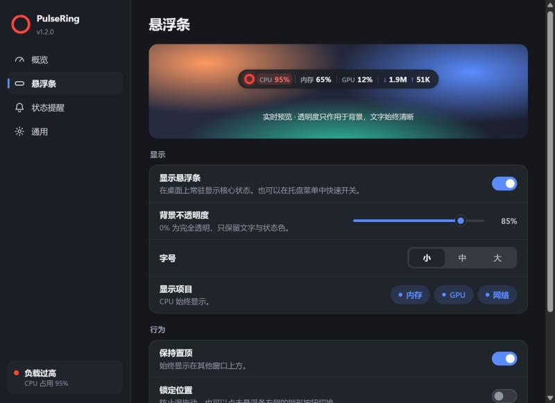

# 脉环

<p align="center">
  
</p>

<p align="center">
  <a href="https://github.com/CG1995/super-lite-status-bar/actions/workflows/ci.yml"></a>
  <a href="https://github.com/CG1995/super-lite-status-bar/releases/latest"></a>
  
  
</p>

脉环是一个基于 Tauri 2 的轻量桌面状态工具，面向 Windows 10/11 和 macOS。它常驻托盘或菜单栏，用一个安静的小入口显示 CPU、内存、显卡和网络状态，不打扰，也不抢屏幕。

English name: PulseRing  
English documentation: [README.md](./README.md)

## 下载

Windows 构建产物发布在 [GitHub Releases 页面](https://github.com/CG1995/super-lite-status-bar/releases/latest)。

- 推荐下载：`PulseRing_1.2.0_x64-setup.exe`
- 备用安装包：`PulseRing_1.2.0_x64_en-US.msi`
- 免安装可执行文件：`PulseRing_1.2.0_x64-portable.exe`

macOS 构建产物也发布在同一个 Releases 页面。

- 推荐下载：`PulseRing_1.2.0_aarch64.dmg`
- 这个 DMG 由 macOS 上的 Tauri 直接生成，不是改后缀的归档文件。

当前 Windows 产物尚未做代码签名，首次运行时 Windows 可能会出现 SmartScreen 提示。
当前 macOS 产物尚未做代码签名，首次打开时 macOS 可能仍会提示。

发布是按 tag 驱动的。GitHub Actions 的发布工作流会从同一个 tag 同时生成 Windows 和 macOS 产物，并直接上传生成好的安装包。

## 预览

<p align="center">
  
</p>

<p align="center">
  
  
</p>

## 监控指标

- CPU 总使用率
- 内存使用量、总量、百分比
- 网络下载 / 上传速度
- GPU 使用率、显存占用、温度和型号，能获取多少显示多少

GPU 采用能力检测。当前平台或硬件无法获取 GPU 数据时，应用不会崩溃，会显示 N/A 或降级展示。

## 当前交互

### 状态颜色

所有界面共用一套状态色：**绿色**（正常）、**橙色**（偏高）、**红色**（告急）。
CPU、内存、GPU 各自独立判定等级，整体状态取三者中最严重的一项。
阈值由“提醒灵敏度”（宽松 / 标准 / 敏感）决定；数值需回落约 4 个百分点后颜色才会恢复，避免在阈值附近来回闪烁。

### Windows

- **托盘图标**是一个色环：颜色代表整体状态，弧长代表当前最需要关注的那项负载。
- **悬停**托盘图标显示状态卡片：整体状态、CPU / 内存 / GPU 进度条、网络速度。
- **左键**打开控制中心；**右键**打开菜单（悬浮条、锁定、鼠标穿透、开机自启、日志、退出）。
- **悬浮条**：胶囊形状，宽度随内容自动调整；透明度只作用于背景，0% 时文字依然清晰。
  拖动移动、双击打开控制中心、右键打开菜单，点击右侧的拖动/锁形按钮即可锁定。
  开启鼠标穿透（需先锁定）后，只有锁形按钮保持可点击。
- **控制中心**：带历史曲线的实时概览、带壁纸实时预览的悬浮条设置、提醒灵敏度与阈值表、刷新频率、主题（跟随系统 / 浅色 / 深色）与开机自启。

### macOS

- Tauri 菜单栏能力已预留。
- 短文本菜单栏模式仍需 macOS 真机测试和完善。

## 技术栈

- Tauri 2
- Rust 后端
- 极简无框架前端：HTML、CSS、JavaScript
- `sysinfo` 采集 CPU、内存、网络计数器
- Windows 上通过进程内动态 NVML（`nvml.dll`）采集 NVIDIA 独显指标，无 NVIDIA 显卡时自动回退为 DXGI + PDH 采集核显（Intel Arc / AMD 等）显存与占用率
- Tauri autostart 插件
- Tauri single-instance 插件

## 构建

Windows 依赖：

- Rust stable 工具链
- Microsoft Visual Studio 2022 Build Tools，需勾选“使用 C++ 的桌面开发”工作负载（含 MSVC 与 Windows SDK）
- 请在 PowerShell 中构建：Git Bash 自带的 `link` 命令会遮蔽 MSVC 链接器
- WebView2 Runtime

运行：

```powershell
cd C:\path\to\super-lite-status-bar\src-tauri
cargo run
```

测试：

```powershell
cd C:\path\to\super-lite-status-bar\src-tauri
cargo test
```

打包：

```powershell
cd C:\path\to\super-lite-status-bar\src-tauri
cargo tauri build --bundles nsis msi --no-sign --ci
```

Windows 打包产物：

```text
src-tauri/target/release/bundle/nsis/PulseRing_1.2.0_x64-setup.exe
src-tauri/target/release/bundle/msi/PulseRing_1.2.0_x64_en-US.msi
src-tauri/target/release/PulseRing_1.2.0_x64-portable.exe
```

macOS 打包：

```bash
cd /path/to/super-lite-status-bar/src-tauri
cargo tauri build --bundles dmg --no-sign --ci
```

```text
src-tauri/target/release/bundle/dmg/PulseRing_1.2.0_aarch64.dmg
```

## 发布

本仓库使用 tag 驱动的发布流程。

- CI 会在 Windows 和 macOS 上运行 `cargo fmt --check`、`cargo clippy --locked --all-targets --all-features -- -D warnings` 和 `cargo test --locked`。
- 发布工作流会在同一个 tag 下自动产出 Windows 安装包和 macOS DMG，例如 `v1.0.0`。
- 正式发布前，需要先更新 `src-tauri/Cargo.toml` 和 `src-tauri/tauri.conf.json` 的版本号；如果版本号变更，README 里的产物文件名也要一起更新。

发布细节见 [docs/RELEASE.md](./docs/RELEASE.md)。

## 安全与隐私

- 不要提交个人 token、GitHub PAT、日志、本地配置文件。
- 用户配置保存到系统用户配置目录。
- 日志写入系统对应的应用日志目录。
- GPU 采集必须保持 best-effort，失败不能影响主流程。

## 当前状态

详见 [docs/DEVELOPMENT_PROGRESS.md](./docs/DEVELOPMENT_PROGRESS.md) 和 [CHANGELOG.md](./CHANGELOG.md)。

## 参与贡献

欢迎提交聚焦的问题和 PR。开始前请阅读 [CONTRIBUTING.md](./CONTRIBUTING.md)、[SUPPORT.md](./SUPPORT.md) 和 [docs/MAINTAINING.md](./docs/MAINTAINING.md)。

安全相关问题请按 [SECURITY.md](./SECURITY.md) 处理。

## License

项目 License 尚未由项目所有者最终确认。
